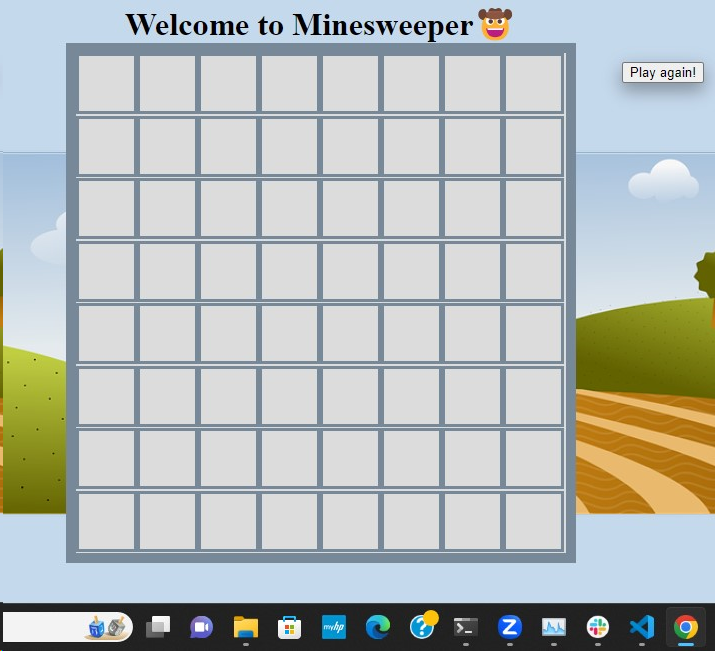

# Project-1---Browser-Based-Game

The game I have chosen for this project is Minesweeper. This is one of the first games I played as a kid, it will be a great challenge and great experience for me to build a replica. 

Minesweeper renders a table with multiple squares that may contain either a mine which ends the game, OR a number of the mines that could be in the area the player clicked on. The player must be careful not to click on a mine. If this is the case the game will be over. The player will win if they are able to click on all the squares that contain numbers only.

User Story

The player must be able to do the following:
 Click on any square in the table 
 Be able to see if they clicked on a mine OR
 Be able to see a display of a number or group of numbers giving the player a hint of where the mines may be located
 
 Be given the option to start new game upon wining or losing previous game

 Technologies used:
 HTML
 CSS
 JavaScript

 Resources:
 Tim and Nabila
 Geeks for Geeks
 Stack Overflow 
 W3Schools 

 Pseudo Code:

 //Create a board with 8 rows, 8 columns, total of 64 same size boxes

 //Add code that generates 10 mines in random squares
 /Add code that displays a number for the adjacent mines, these must be non-visible until player clicks on the squares

 //Render game upon loading browser

 //Creat function to listen for player's click 

 //If  player uncovers a mine the game will be over, if player uncovers a number, player will have the chance to click on another square
 
 //End game if player hits a mine

 //Set up button if player wants to play again  
 
 What is next??

 -Add flag feature

 -Add win game banner

 -Add difficulty levels people can choose from 

 -Add sound effects
 
